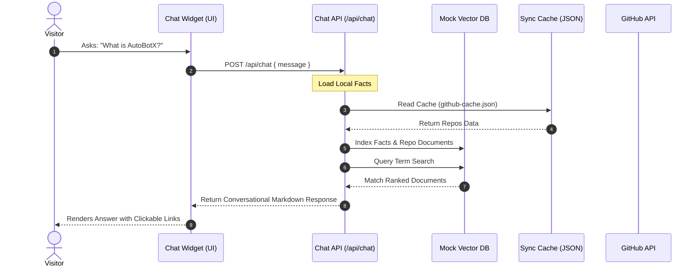

# Nandini — Personal Portfolio & AI Digital Twin 🚀

[](https://nextjs.org/)
[](https://react.dev/)
[](https://www.typescriptlang.org/)
[](https://tailwindcss.com/)

A premium, interactive personal portfolio website featuring a future-ready **AI Portfolio Assistant** acting as a digital twin. Built on **Next.js (App Router)** and styled using **Tailwind CSS v4** with hardware-accelerated **Framer Motion** animations.

---

## ✨ Features

### 🎨 Portfolio Ecosystem
- **Futuristic Dark Aesthetic**: Immersive glassmorphic design utilizing cyan and fuchsia gradients.
- **Neural Learning Timeline**: Interactive education and credentials pathway with custom status metrics.
- **Wins Grid**: Clean, hover-activated achievements dashboard showcasing Hackathon and Open Source milestones.
- **Social Orbit Loop**: Rotating interactive socials console tracking cursor signals to map connections.
- **Custom Cursor & Noise Overlays**: Smooth custom magnetic cursor and subtle film-grain texture.

### 🤖 AI Digital Twin (Portfolio Assistant)
- **Glassmorphic Chat Interface**: Responsive widget floating in the layout with entry scale animations.
- **Quick Action Cards**: Tap-to-explore triggers (Projects, Resume, GitHub, Community, Wins, Contact) allowing zero-type navigation.
- **RAG Architecture & Mock Vector DB**: Local query semantic-matching search library mapping requests to indexed portfolio documents.
- **YouTube Linkage**: Seamless links pointing to Youtube channel `@self_taught_bob` for mentorship content.
- **Voice Mode Visualizer**: Interactive speech panel with animated SVG equalizer wave patterns.

---

## 🏗️ Architecture

The personal assistant runs on a modular, future-ready structure separating client interfaces, caching rules, and document vector mappings.



---

## 📂 Project Structure

```text
Portfolio/                     # Repository Root
├── portfolio-next/            # Next.js Application Core
│   ├── app/                   # App Router Directory
│   │   ├── api/               # API Endpoints
│   │   │   ├── chat/          # Smart conversational search route
│   │   │   ├── contact/       # Contact form receiver (stub)
│   │   │   └── sync/          # Manual/Cron GitHub cache rebuilder
│   │   ├── globals.css        # Global CSS + Tailwind v4 theme mapping
│   │   ├── layout.tsx         # Root layout HTML structure
│   │   └── page.tsx           # Portfolio landing page loader
│   ├── components/            # React Components
│   │   ├── chat/              # Chat assistant widget files
│   │   └── portfolio/         # Hero, Skills, Education, Footer, etc.
│   ├── data/                  # Cached local JSON files
│   └── lib/                   # Utility helpers and core RAG stubs
└── README.md                  # Project Documentation
```

---

## 🛠️ Quick Start & Local Development

### Prerequisites
- Node.js **18.0.0+**
- npm **10.0.0+**

### Steps to Run
1. Clone the repository and navigate into the app folder:
   ```bash
   cd portfolio-next
   ```
2. Install the dependencies:
   ```bash
   npm install
   ```
3. Boot up the local development server:
   ```bash
   npm run dev
   ```
4. Build the repository cache from GitHub:
   Open your browser and navigate to `http://localhost:3000/api/sync`. This triggers the GitHub API sync and builds your local repository index in `portfolio-next/data/github-cache.json`.

---

## 🚀 Deployment Troubleshooting (Vercel & Netlify)

If your deployments are failing or returning broken pages on Vercel or Netlify, it is likely because **the Next.js project is inside the `portfolio-next` subdirectory**, not the repository root. Sourcing builds from the root directly will fail because there is no `package.json` at that level.

Follow these instructions to configure subdirectory builds:

### 📐 Vercel Configuration
1. In the Vercel Dashboard, select **New Project** and import the repository.
2. In the **Configure Project** screen, locate the **Root Directory** option.
3. Click **Edit** next to Root Directory and select the `portfolio-next` folder.
4. Keep the Framework Preset as **Next.js**.
5. Click **Deploy**. Vercel will now automatically build from the correct folder.

### 📐 Netlify Configuration
To deploy on Netlify, either set the directory settings in the Netlify Dashboard, or add a configuration file.

#### Option A: Dashboard Settings
1. In Netlify, import the repository.
2. Under **Build settings**, set:
   - **Base directory**: `portfolio-next`
   - **Build command**: `npm run build`
   - **Publish directory**: `portfolio-next/.next`
3. Save and click **Deploy**.

#### Option B: Configuration File (Recommended)
You can create a `netlify.toml` file in the **repository root folder** (parallel to this README) containing these rules:
```toml
[build]
  base = "portfolio-next"
  publish = "portfolio-next/.next"
  command = "npm run build"
```
Netlify will read this file and build from the subdirectory without requiring any dashboard adjustments.
